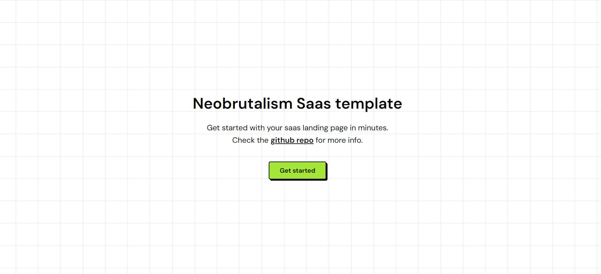

# YOL — You Only Loop

A YouTube looping web app. Loop any video with precise A/B points, control playback speed, repeat counts, playlists with folders, watch history, multi-language UI, and Google sign-in to sync across devices.

Live at [youtubeonloop.com](https://youtubeonloop.com).

## Stack

- Next.js 14 (app router) + TypeScript + Tailwind (neobrutalism theme)
- Drag-and-drop via `@hello-pangea/dnd`
- Custom backend at `NEXT_PUBLIC_API_URL` (default `http://localhost:3001`)
- i18n: EN / DE / JA / FR

## Get started

This project uses `pnpm`. Install dependencies:

```bash
pnpm i
```

Run locally:

```bash
pnpm run dev
```

Build:

```bash
pnpm run build
```

## Project notes

- App UI lives in `src/app/page.tsx`
- Playlist / folder / auth / language hooks in `src/lib/`
- Translation strings in `src/lib/translations.ts`
- Feature status tracked in `FEATURES.md`
